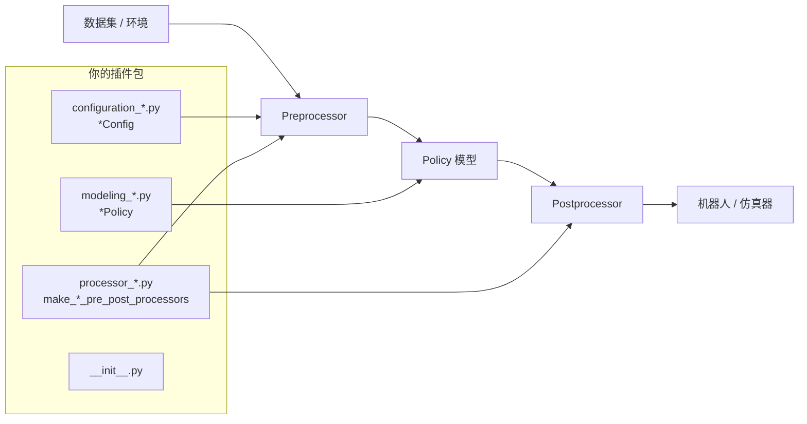
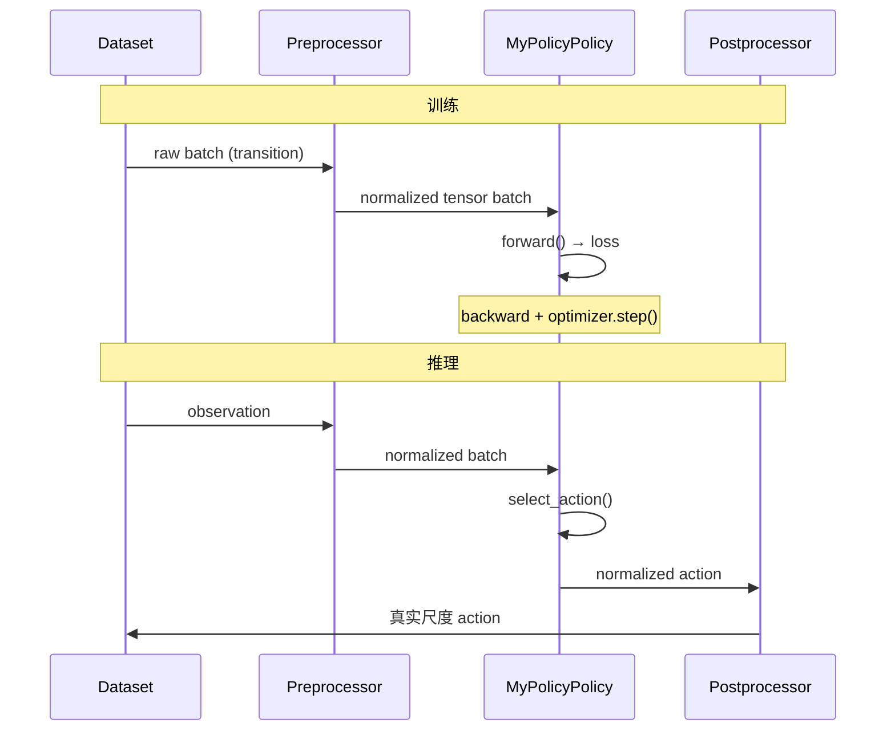

### LeRobot 自定义 Policy 接入教程

> 目标：把你的算法封装成 LeRobot 认可的 Policy，从而直接使用 `lerobot-train`、`lerobot-eval`、Hub 上传/下载等全套工具链。
>
> 参考：[LeRobot 官方文档 - Bring Your Own Policies](https://huggingface.co/docs/lerobot/v0.4.4/en/bring_your_own_policies)

---

### 整体架构：你需要实现什么？

LeRobot 的 Policy 不是「一个 `nn.Module`」那么简单，而是 **4 个组件 + 严格命名约定**：



| 组件 | 职责 | 本仓库参考 |
|------|------|-----------|
| **Config** | 超参、输入输出特征、优化器/调度器 | `lerobot/policies/pi05/configuration_pi05.py` |
| **Policy** | 网络结构、训练 loss、推理 action | `lerobot/policies/pi05/modeling_pi05.py` |
| **Processor** | 归一化、tokenize、设备迁移等 | `lerobot/policies/pi05/processor_pi05.py` |
| **Package** | 安装后被 LeRobot 自动发现 | 包名 `lerobot_policy_xxx` |

---

### 两种接入方式（选一种）

#### 方式 A：独立插件包（推荐，官方方式）

- 包名必须以 **`lerobot_policy_`** 开头
- `pip install -e .` 后，LeRobot 脚本启动时自动 import
- **不需要改 LeRobot 源码**

#### 方式 B：直接改 LeRobot 源码

- 在 `lerobot/policies/your_policy/` 下新建目录
- 还需在 `factory.py` 里手动加 `elif name == "your_policy"` 分支
- 适合私有 fork、不打算发布插件的场景

**本教程以方式 A 为主**；本仓库里的 `pi05` 是方式 B 的内置示例。

---

### 关键命名约定（踩坑最多）

LeRobot 通过 **反射 + 命名规则** 动态加载第三方 Policy，必须严格遵守：

| 规则 | 示例 |
|------|------|
| 注册名（CLI 用） | `@PreTrainedConfig.register_subclass("my_policy")` |
| Config 类名 | `MyPolicyConfig`（必须以 `Config` 结尾） |
| Policy 类名 | `MyPolicyPolicy`（Config 去掉 `Config` + 加 `Policy`） |
| Config 模块 | `configuration_my_policy.py` |
| Model 模块 | `modeling_my_policy.py`（把 `configuration_` 替换成 `modeling_`） |
| Processor 模块 | `processor_my_policy.py` |
| Processor 工厂函数 | `make_my_policy_pre_post_processors`（`make_{注册名}_pre_post_processors`） |
| Python 包名 | `lerobot_policy_my_policy` |

对应本仓库 `factory.py` 中的加载逻辑：

```python
# FooConfig → modeling_foo 模块中的 FooPolicy
module_path = config_cls.__module__.replace("configuration_", "modeling_")

# make_{type}_pre_post_processors，模块 configuration_* → processor_*
function_name = f"make_{policy_type}_pre_post_processors"
module_path = config.__class__.__module__.replace("configuration_", "processor_")
```

源码位置：`my_vla/src/lerobot/src/lerobot/policies/factory.py`

---

### 目录结构

```bash
lerobot_policy_my_policy/
├── pyproject.toml
└── src/
    └── lerobot_policy_my_policy/
        ├── __init__.py
        ├── configuration_my_policy.py    # MyPolicyConfig
        ├── modeling_my_policy.py         # MyPolicyPolicy
        └── processor_my_policy.py        # make_my_policy_pre_post_processors
```

---

### Step 1：pyproject.toml

```toml
[project]
name = "lerobot_policy_my_policy"   # 必须以 lerobot_policy_ 开头！
version = "0.1.0"
requires-python = ">=3.11"
dependencies = [
    "lerobot",          # 或你的本地 editable 安装
    "torch",
]

[build-system]
requires = ["hatchling"]
build-backend = "hatchling.build"

[tool.hatch.build.targets.wheel]
packages = ["src/lerobot_policy_my_policy"]
```

---

### Step 2：Config（配置类）

Config 继承 `PreTrainedConfig`，负责：**超参、特征定义、优化器/调度器、时间索引**。

```python
# configuration_my_policy.py
from dataclasses import dataclass, field

from lerobot.configs.policies import PreTrainedConfig
from lerobot.configs.types import FeatureType, NormalizationMode, PolicyFeature
from lerobot.optim.optimizers import AdamWConfig
from lerobot.optim.schedulers import CosineDecayWithWarmupSchedulerConfig
from lerobot.utils.constants import ACTION, OBS_STATE


@PreTrainedConfig.register_subclass("my_policy")  # CLI: --policy.type my_policy
@dataclass
class MyPolicyConfig(PreTrainedConfig):
    # --- 策略特有超参 ---
    chunk_size: int = 50          # 一次预测多少步 action
    n_action_steps: int = 50      # 实际执行多少步（≤ chunk_size）
    hidden_dim: int = 256

    # --- 归一化方式 ---
    normalization_mapping: dict[str, NormalizationMode] = field(
        default_factory=lambda: {
            "VISUAL": NormalizationMode.MEAN_STD,
            "STATE": NormalizationMode.MIN_MAX,
            "ACTION": NormalizationMode.MIN_MAX,
        }
    )

    def __post_init__(self):
        super().__post_init__()
        if self.n_action_steps > self.chunk_size:
            raise ValueError("n_action_steps 不能大于 chunk_size")

    def validate_features(self) -> None:
        """根据数据集/环境推断或补全 input/output features。"""
        if OBS_STATE not in self.input_features:
            self.input_features[OBS_STATE] = PolicyFeature(
                type=FeatureType.STATE, shape=(7,)  # 按你的机器人维度改
            )
        if ACTION not in self.output_features:
            self.output_features[ACTION] = PolicyFeature(
                type=FeatureType.ACTION, shape=(7,)
            )

    def get_optimizer_preset(self) -> AdamWConfig:
        return AdamWConfig(lr=1e-4, weight_decay=1e-4, grad_clip_norm=10.0)

    def get_scheduler_preset(self):
        return CosineDecayWithWarmupSchedulerConfig(
            peak_lr=1e-4, decay_lr=1e-5,
            num_warmup_steps=500, num_decay_steps=50_000,
        )

    # --- 训练时数据采样的时间索引（必须实现）---
    @property
    def observation_delta_indices(self) -> list | None:
        return list(range(1 - self.n_obs_steps, 1))  # 取最近 n_obs_steps 帧

    @property
    def action_delta_indices(self) -> list:
        return list(range(self.chunk_size))          # 预测未来 chunk

    @property
    def reward_delta_indices(self) -> None:
        return None
```

#### Config 必须实现的接口

| 方法 / 属性 | 说明 |
|-------------|------|
| `validate_features()` | 补全或校验 input/output features |
| `get_optimizer_preset()` | 返回优化器配置 |
| `get_scheduler_preset()` | 返回学习率调度器配置 |
| `observation_delta_indices` | 训练时取哪些历史观测帧 |
| `action_delta_indices` | 训练时取哪些未来 action 帧 |
| `reward_delta_indices` | RL 策略用；模仿学习通常返回 `None` |

---

### Step 3：Policy（模型类）

继承 `PreTrainedPolicy`，实现 **5 个抽象方法**：

```python
# modeling_my_policy.py
import torch
from torch import Tensor, nn

from lerobot.policies.pretrained import PreTrainedPolicy
from lerobot_policy_my_policy.configuration_my_policy import MyPolicyConfig


class MyPolicyPolicy(PreTrainedPolicy):
    config_class = MyPolicyConfig
    name = "my_policy"

    def __init__(self, config: MyPolicyConfig):
        super().__init__(config)
        self.model = nn.Sequential(
            nn.Linear(config.hidden_dim, config.hidden_dim),
            nn.ReLU(),
            nn.Linear(config.hidden_dim, config.action_feature.shape[0]),
        )
        self._action_queue = None  # action chunking 用

    def get_optim_params(self) -> dict:
        return self.parameters()

    def reset(self):
        """环境 reset 时清空 action 队列。"""
        self._action_queue = None

    def forward(self, batch: dict[str, Tensor]) -> tuple[Tensor, dict | None]:
        """训练：返回 (loss, metrics_dict)。"""
        pred = self.model(batch["observation.state"])
        loss = nn.functional.mse_loss(pred, batch["action"])
        return loss, {"mse": loss.item()}

    def predict_action_chunk(self, batch: dict[str, Tensor], **kwargs) -> Tensor:
        """推理：预测一整段 action chunk，shape [B, chunk_size, action_dim]。"""
        state = batch["observation.state"]
        single = self.model(state)                       # [B, action_dim]
        return single.unsqueeze(1).expand(-1, self.config.chunk_size, -1)

    def select_action(self, batch: dict[str, Tensor], **kwargs) -> Tensor:
        """推理：返回单步 action（可内部维护 chunk 队列）。"""
        if self._action_queue is None or len(self._action_queue) == 0:
            chunk = self.predict_action_chunk(batch)
            self._action_queue = [chunk[:, i] for i in range(self.config.n_action_steps)]
        return self._action_queue.pop(0)
```

#### Policy 必须实现的接口

| 方法 | 何时调用 |
|------|----------|
| `get_optim_params()` | 构建 optimizer |
| `reset()` | 每个 episode 开始 |
| `forward(batch)` | 训练 |
| `predict_action_chunk(batch)` | 推理（chunk 策略） |
| `select_action(batch)` | 推理（逐步执行） |

---

### Step 4：Processor（数据流水线）

Processor 负责把 **原始 transition → 模型输入 → 反归一化 action**。

```python
# processor_my_policy.py
from typing import Any

import torch

from lerobot.processor import (
    AddBatchDimensionProcessorStep,
    DeviceProcessorStep,
    NormalizerProcessorStep,
    PolicyAction,
    PolicyProcessorPipeline,
    UnnormalizerProcessorStep,
)
from lerobot.processor.converters import policy_action_to_transition, transition_to_policy_action
from lerobot.utils.constants import POLICY_POSTPROCESSOR_DEFAULT_NAME, POLICY_PREPROCESSOR_DEFAULT_NAME
from lerobot_policy_my_policy.configuration_my_policy import MyPolicyConfig


def make_my_policy_pre_post_processors(
    config: MyPolicyConfig,
    dataset_stats: dict[str, dict[str, torch.Tensor]] | None = None,
) -> tuple[
    PolicyProcessorPipeline[dict[str, Any], dict[str, Any]],
    PolicyProcessorPipeline[PolicyAction, PolicyAction],
]:
    input_steps = [
        AddBatchDimensionProcessorStep(),
        NormalizerProcessorStep(
            features={**config.input_features, **config.output_features},
            norm_map=config.normalization_mapping,
            stats=dataset_stats,
        ),
        DeviceProcessorStep(device=config.device),
    ]

    output_steps = [
        UnnormalizerProcessorStep(
            features=config.output_features,
            norm_map=config.normalization_mapping,
            stats=dataset_stats,
        ),
        DeviceProcessorStep(device="cpu"),
    ]

    return (
        PolicyProcessorPipeline(steps=input_steps, name=POLICY_PREPROCESSOR_DEFAULT_NAME),
        PolicyProcessorPipeline(
            steps=output_steps,
            name=POLICY_POSTPROCESSOR_DEFAULT_NAME,
            to_transition=policy_action_to_transition,
            to_output=transition_to_policy_action,
        ),
    )
```

复杂策略（如 `pi05`）会额外加 Tokenizer、自定义 `ProcessorStep` 等，但基本骨架就是：**Normalize → 自定义变换 → Device → 反 Normalize**。

---

### Step 5：__init__.py（包入口）

```python
# __init__.py
try:
    import lerobot  # noqa: F401
except ImportError as e:
    raise ImportError("请先安装 lerobot") from e

from .configuration_my_policy import MyPolicyConfig
from .modeling_my_policy import MyPolicyPolicy
from .processor_my_policy import make_my_policy_pre_post_processors

__all__ = ["MyPolicyConfig", "MyPolicyPolicy", "make_my_policy_pre_post_processors"]
```

#### 插件发现机制

LeRobot 启动时会扫描所有以 `lerobot_policy_` 开头的已安装包并 import：

```python
# lerobot/utils/import_utils.py
def register_third_party_plugins() -> None:
    prefixes = (..., "lerobot_policy_")
    for dist in importlib.metadata.distributions():
        if dist_name.startswith(prefixes):
            importlib.import_module(dist_name)
```

`lerobot-train`、`lerobot-eval` 等脚本在入口处均会调用 `register_third_party_plugins()`。import 包时会执行 `@PreTrainedConfig.register_subclass(...)`，完成注册。

---

### 安装与使用

```bash
# 1. 安装 LeRobot（若尚未安装）
cd /vla/my_vla/src/lerobot && pip install -e .

# 2. 安装你的 Policy 插件
cd /path/to/lerobot_policy_my_policy && pip install -e .

# 3. 验证注册是否成功
python -c "from lerobot.configs.policies import PreTrainedConfig; print('my_policy' in PreTrainedConfig.get_known_choices())"
# 应输出 True

# 4. 开始训练
lerobot-train \
    --policy.type my_policy \
    --dataset.repo_id your_user/your_dataset \
    --steps 100000
```

---

### 数据流（训练 vs 推理）



#### batch 字典常见 key

| Key | 说明 |
|-----|------|
| `observation.state` | 机器人关节状态 |
| `observation.images.*` | 相机图像 |
| `action` | 训练时的 ground truth action |

---

### 自检清单（上线前逐项核对）

- [ ] 包名以 `lerobot_policy_` 开头
- [ ] `@PreTrainedConfig.register_subclass("xxx")` 的 `xxx` 与 CLI `--policy.type` 一致
- [ ] Config 类名以 `Config` 结尾，Policy 类名 = 去掉 `Config` + `Policy`
- [ ] 三个模块文件名：`configuration_*` / `modeling_*` / `processor_*` 后缀一致
- [ ] Processor 函数名：`make_{type}_pre_post_processors`
- [ ] Config 实现了全部 abstract：`validate_features`、`get_optimizer_preset`、`get_scheduler_preset`、三个 `*_delta_indices`
- [ ] Policy 实现了全部 abstract：`get_optim_params`、`reset`、`forward`、`predict_action_chunk`、`select_action`
- [ ] `pip install -e .` 后 `PreTrainedConfig.get_known_choices()` 包含你的 type
- [ ] 简单 forward + select_action 冒烟测试通过

---

### 常见问题

| 问题 | 原因 / 解决 |
|------|-------------|
| `Policy type 'xxx' is not available` | 插件未安装，或 `register_subclass` 未执行（检查 `__init__.py` 是否被 import） |
| `does not follow the expected naming convention` | Config 类名没以 `Config` 结尾 |
| `ModuleNotFoundError: modeling_xxx` | 模块路径不对，检查文件名是否与 configuration 模块对应 |
| `make_xxx_pre_post_processors not found` | 函数名或 processor 模块名不匹配 |
| 训练 loss 为 NaN | 检查 Normalizer 的 `dataset_stats` 是否正确传入 |
| action 尺度不对 | Postprocessor 的 `UnnormalizerProcessorStep` 是否配置正确 |

---

### 参考资源

| 资源 | 说明 |
|------|------|
| [官方文档](https://huggingface.co/docs/lerobot/v0.4.4/en/bring_your_own_policies) | 原始教程 |
| 本仓库 `pi05` | 完整内置示例：`configuration_pi05.py` / `modeling_pi05.py` / `processor_pi05.py` |
| [DiTFlow 社区插件](https://github.com/danielsanjosepro/lerobot_policy_ditflow) | 独立插件包完整范例 |
| [DiTFlow 使用示例](https://github.com/danielsanjosepro/test_lerobot_policy_ditflow) | 端到端训练 demo |
